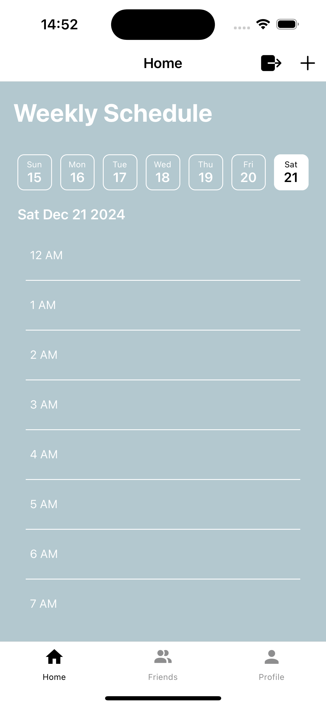
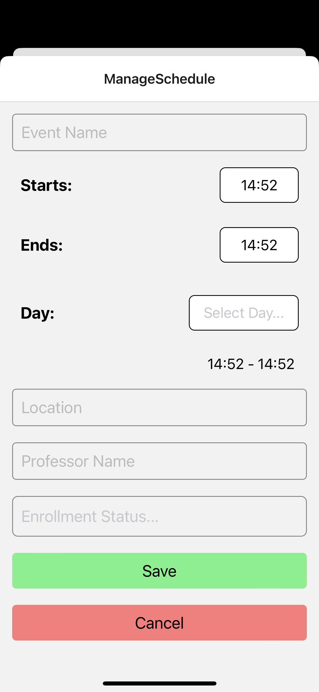
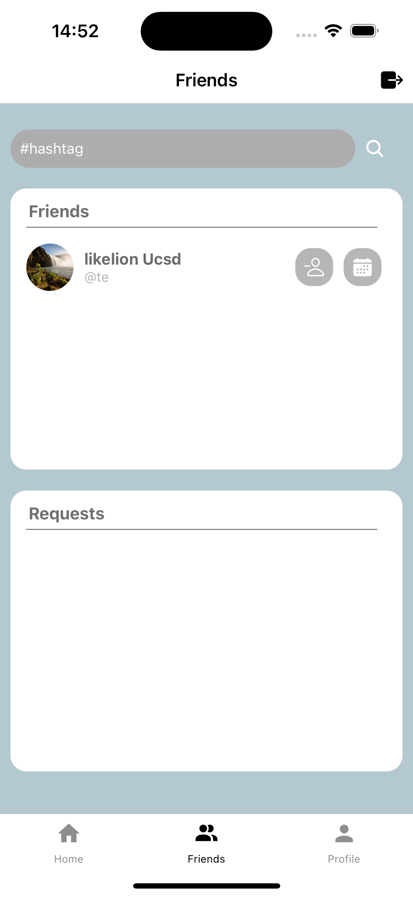
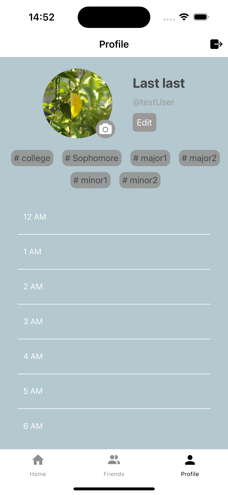
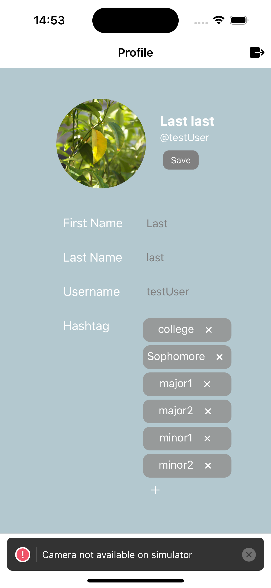

# WebReg App

## Description

The WebReg App is a mobile application designed for UCSD students to share and compare their schedules effortlessly. By addressing the challenges of schedule sharing via WebReg, this app enables students to collaborate on course planning and optimize their academic schedules with friends.

**Team**: Andrew Park, Chanbin Na, Jinseo Choi, Se ah Park, Donghyun Ko, Sang-gyu An

---

## Demo

Still in development.

---

## Screenshots

    
    

    
    

    
    

---

## Features

### Schedule Management
- **Create and Share Schedules**: Add courses and build a personal schedule.
- **Public Schedule Sharing**: Make schedules visible to other students for easy collaboration.

### Friends Integration
- **Add Friends**: Connect with other students to view their schedules.
- **Friend Requests**: Send and accept friend requests directly in the app.
- **Friend Management**: Remove friends or manage your friend list.

### Profile Customization
- **Profile Setup**: Create a profile with custom photos and hashtags.
- **Hashtags**: Add hashtags to your profile for easy discovery by other students.
- **Profile Editing**: Update or delete hashtags and modify profile details.

---

## Tech Stack

### Frontend
- **React Native**: Built a responsive and interactive mobile app interface.
- **Expo**: Developed the app using Expo for easy deployment and testing.

### Backend
- **Firebase**: Utilized Firebase for backend logic and real-time database management.

### Database
- **Firebase Realtime Database**: Stored user profiles, schedules, and friend relationships.

---

## Specifications

### Schedule Creation
- Add courses and create personalized schedules.
- Share schedules publicly to enable comparison and collaboration.

### Friends Integration
- Add and manage friends to access their schedules.
- Send and receive friend requests for seamless connectivity.

### Profile Customization
- Set up profiles with custom photos and hashtags for easy discoverability.
- Edit or remove profile details and hashtags as needed.
